This is a simple lab to show you how to activate Vorlon.js Bot Framework Inspector on your Bot.

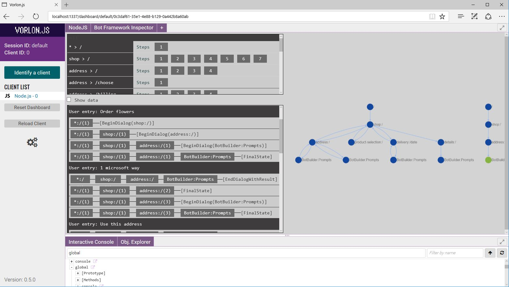

# Install Vorlon.js

The first thing you have to do is get an instance of Vorlon.js running.
If you want to debug your bot locally (which is going to be the case a lot of times) you have two choices:
- Way 1 :
    - Clone the Vorlon.js repo: [https://github.com/MicrosoftDX/Vorlonjs](https://github.com/MicrosoftDX/Vorlonjs) 
    - Run ```npm install``` on the vorlon.js folder
    - Run ```npm start``` to start the vorlon.js instance
- Way 2 :
    - Run ```npm install -g vorlon``` from the command line
    - Run ```vorlon``` to start the vorlon.js instance

Way 1 gives you the possibility to edit the vorlon.js code if you want while Way 2 just install the latest bits.

At that point you should have a Vorlon.js instance running :

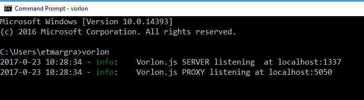 

You can navigate to the Vorlon.js dashboard using [http://localhost:1337/dashboard/default](http://localhost:1337/dashboard/default)

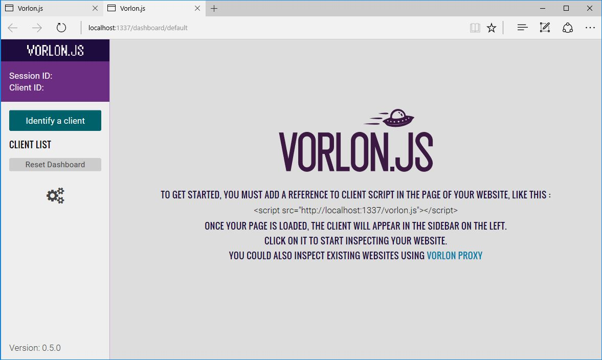

# Connect your bot to your Vorlon.js instance

To be able to connect your bot and see it in the Vorlon.js Dashboard you have to follow these steps:
- Install an NPM package to be able to download the client script from Vorlon instance and start it. For that, run ```npm install vorlon-node-wrapper``` (with the optionnal ```-save-dev``` parameter to save it in your package.json)
- Require the package in your main bot file **before** anything else : ```var vorlonWrapper = require('vorlon-node-wrapper');```
- Start the vorlon client **before** the rest of your code: ```vorlonWrapper.start("http://localhost:1337", "default", false);```

And that is it! Now each time you start your bot, it is going to connect to the Vorlon.js instance if it is started.

You can see an example of it in the ContosoFlowers code version that is available in this repo.

```
// ========== VORLON Setup
var vorlonWrapper = require("vorlon-node-wrapper");
vorlonWrapper.start("http://localhost:1337", "default", false);
```

Reference file: [samples/contosoflowers/bot/index.js](./samples/contosoflowers/bot/index.js)

3. Inspect your bot

Vorlon.js is a plugin based tool. Each plugin has a tab which appears in the Dashboard. The code that you referenced inside of your node bot is the *client* part of these plugins.
This client part is sending information to the dashboard which is then displayed to you.

You can find more information about Vorlon and how it can help you debugging front websites too here : [http://vorlonjs.io/#getting-started](http://vorlonjs.io/#getting-started)

Here is a review of the plugins that can help you debugging your bot:

- **NodeJS** plugin

This one is a generic node plugin that show node information such as the list of modules you required, the memory usage and some process informations

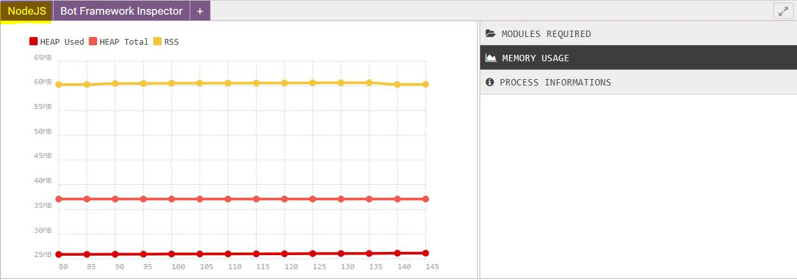

- **Interactive console** plugin

Everything that is logged in the node.js console will be also displayed here. You can filter to see only errors or warnings. You also can use the test input at the bottom of the plugin to execute JavaScript code in the Node.js instance. You can change a variable state or whatever you need.

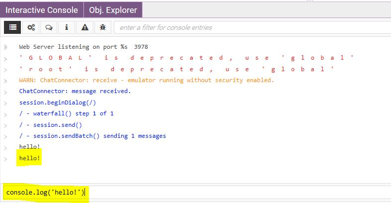

- **Obj. Explorer** plugin

All the global variable are visible here. Due to JavaScript scoping your can not see the local variables there. If you want to see a specific one you will have to assign it to a variable by doing something similar to : ```global.myVariable = myValue;```

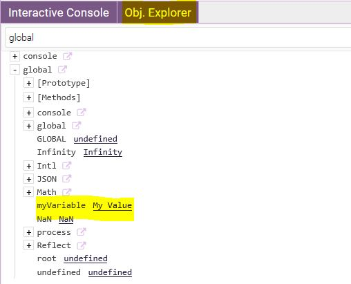

- **Bot Framework Inspector** plugin

This plugin is the one that will be really helpful to debug bot. It has been design to show you information about what is happening inside your bot code.

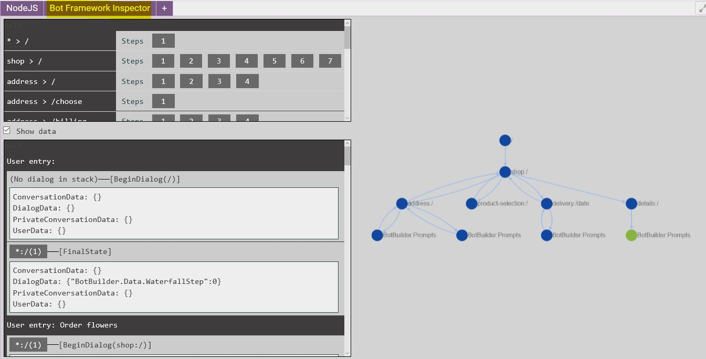

The plugin is separated into 3 parts. The upper left one is showing you the list of dialogs that are declared in your bot. Each line is a dialog and its id is composed of the library name (* if you do not have any library) and the actual dialog name.

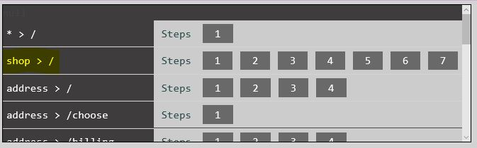

On the right you can see the list of steps you have in each dialog. If you let your move over one of them you will have a quick view of its code.

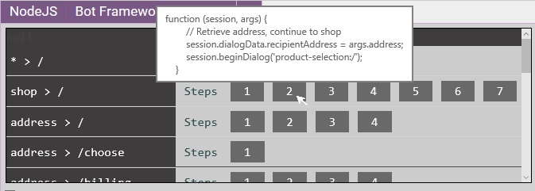

On the lower left part of the plugin, you can see the live view of events happening inside your bot. You have to actually start interacting with it to see things here :)

In the botbuilder, each user entry generates one or more events. These events are thights to your bot code. For instance, each time a dialog start, there is a BeginDialog event happening. You can see all these in this view. When the botbuilder is done with all the events generated by one user entry, it automatically save the state. This end up launching a FinalSate event.

For each event, you can see the current dialog stack. The dialog stack is the list of dialogs that are currently started. One dialog starts another on, which starts another one, and so on. The dialog usually only ends when EndDialog is called. The dialog stack state is memorized between 2 user entries.

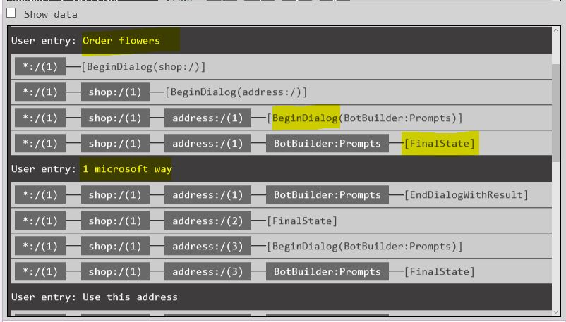

The last part of the plugin is the live graph. It is generated by the bot execution and it thighly coupled with the event view. It is built live while you are using the bot. It is interesting to have a graphical overview of what is happening inside your bot and can help you discover and fix dialog stack issues.

Whenever you have 0 dialogs in the stack or you call endConversation, a new graph is creating on the right.

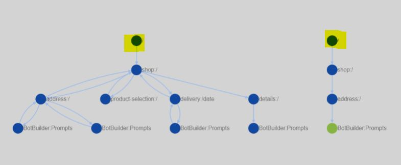

# Try it on your bot!

Try it on your bot or on the [contoso flowers sample bot](./samples/contosoflowers) and please share your feedbacks with us:
- [@meulta](http://twitter.com/meulta)
- [@davrous](http://twitter.com/davrous)

Do you miss a feature? Something not working properly? Don't hesitate! :)